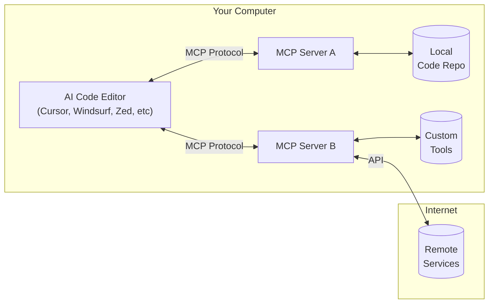

# Building Your Own MCP Server: Supercharge AI-Powered Code Editors in 2025

*Connect Claude, Cursor, Windsurf, Zed and more with a universal AI protocol*

## TL;DR
In just 15 minutes, build a universal bridge that connects any AI code editor to your custom tools and data. MCP servers let you extend Claude, Cursor, Windsurf, and other editors with personalized capabilities while maintaining full control over your data.

---

**Note:** This article represents a snapshot of the Model Context Protocol (MCP) implementation as of March 2025. Since the MCP ecosystem is rapidly evolving, readers should check the official documentation for each client (Claude, Cursor, Windsurf, Zed) for the most current information and implementation details.

## Important Implementation Notes

### Client Support Status
As of March 2025, Claude Desktop and Cursor offer robust MCP support, while Windsurf and Zed implementations may vary in features and stability. Always check each client's latest documentation for current compatibility.

### Code Implementation
The code examples provided are for demonstration purposes and may need additional error handling and optimization for production environments. Consider this a starting point rather than a production-ready solution.

### Security Improvements
To enhance security, implement path sanitization to prevent directory traversal attacks:
```python
import os.path
directory = os.path.normpath(os.path.join(base_directory, user_input))
if not directory.startswith(base_directory):
    return [types.TextContent(type="text", text="Access denied: Invalid directory")]
```

### Client-Specific Instructions
For Windsurf, locate the MCP configuration in Settings → AI → External Tools. For Zed, refer to their documentation for the latest MCP integration steps as the implementation details may have changed since publication.

### Testing Recommendation
Before deploying your MCP server, thoroughly test it with each client you intend to support. Client behaviors may differ slightly, especially regarding tool discovery and parameter passing.

## What is MCP and Why Should You Care?

The Model Context Protocol (MCP) is the AI world's USB-C - a universal connector that's changing how we interact with Large Language Models (LLMs). Released by Anthropic in late 2024, MCP allows developers to build secure, two-way connections between AI models and external tools or data sources.

This means your AI coding assistants like Cursor, Windsurf, Claude Code, and Zed can now access:

- Your local files and databases
- Custom tools you've created
- Third-party APIs and services
- Private documentation

All while keeping sensitive data within your infrastructure.



If you've ever wished your AI assistant could truly understand your codebase, access your internal tools, or connect to specialized services, MCP is your answer.

## Getting Started with MCP Server Development

Let's build a simple but useful MCP server that any compatible client can connect to. We'll create a server with tools that can:

1. Search your codebase intelligently
2. Execute custom code analysis
3. Connect to external development APIs

### Prerequisites

- Python 3.10+ or Node.js 16+
- Basic understanding of JSON-RPC
- An MCP-compatible client (Claude Desktop, Cursor, Windsurf, Zed, etc.)

### Step 1: Setting Up Your MCP Server Project

We'll use Python with the official MCP SDK for this example. Create a new project directory and set up your environment:

```bash
# Create a project directory
mkdir my-mcp-server
cd my-mcp-server

# Create a virtual environment
python -m venv venv
source venv/bin/activate  # On Windows: venv\Scripts\activate

# Install dependencies
pip install mcp httpx
```

### Step 2: Implementing a Basic MCP Server

Create a file named `server.py` with the implementation found in this repository.

### Step 3: Running Your MCP Server

You can run the server in two modes:

1. **STDIO mode** (useful for desktop clients like Claude Desktop):
   ```bash
   python server.py
   ```

2. **SSE mode** (useful for web-based clients):
   ```bash
   python server.py sse 8000
   ```

## Connecting Your MCP Server to Clients

Now that you have a working MCP server, let's connect it to different clients:

### Claude Desktop

1. Edit your Claude Desktop configuration file:
   - On macOS: `~/Library/Application Support/Claude/claude_desktop_config.json`
   - On Windows: `%APPDATA%\Claude\claude_desktop_config.json`

2. Add your server configuration:

```json
{
    "mcpServers": {
        "dev-tools": {
            "command": "python",
            "args": [
                "/absolute/path/to/my-mcp-server/server.py"
            ]
        }
    }
}
```

3. Restart Claude Desktop and look for the tools icon to appear.

### Cursor IDE

For Cursor, you'll typically use the SSE transport:

1. Run your server in SSE mode:
   ```bash
   python server.py sse 8000
   ```

2. In Cursor, go to Settings → Features → MCP Servers
3. Add a new server with:
   - Name: `dev-tools`
   - Type: `sse`
   - URL: `http://localhost:8000/sse`

### Testing Your MCP Server

You can use the included `app.py` script to test your MCP server locally without a client:

```bash
python app.py
```

This will start the server, send test commands, and display the responses.

## Using MCP Servers in Real-World Development

MCP servers aren't just a cool tech demo - they can transform your development workflow:

### Personalized Documentation Assistant

Connect your MCP server to your internal documentation, code repositories, and knowledge bases to create a personalized assistant that truly understands your project.

### Workflow Automation Helper

Automate common development tasks directly from your AI assistant, such as running tests, formatting code, or deploying changes.

### Code Quality Guardian

Create tools that enforce code quality standards across your team by integrating with linters, static analyzers, and code review checklists.

## Conclusion

MCP servers represent a paradigm shift in how developers interact with AI. By building your own MCP server, you create a bridge between your development environment and AI assistants, unlocking new possibilities for productivity and creativity.

The technology is still evolving rapidly, but early adopters are already seeing significant workflow improvements. Whether you're using Claude, Cursor, Windsurf, Zed, or any other MCP-compatible client, a custom MCP server puts you in control of how AI interacts with your development environment.

---

## Resources

- [Model Context Protocol Documentation](https://modelcontextprotocol.io/)
- [Anthropic MCP GitHub Repository](https://github.com/modelcontextprotocol)
- [Claude Desktop Configuration Guide](https://docs.anthropic.com/claude/docs/claude-desktop-mcp-setup)
- [Cursor IDE Documentation](https://cursor.sh/docs/mcp-integration)

---

*What MCP server features would you like to build? Let me know in the comments below!*

*Tags: #AI #Development #MCP #Claude #Cursor #Windsurf #Zed #Programming #AITools*
